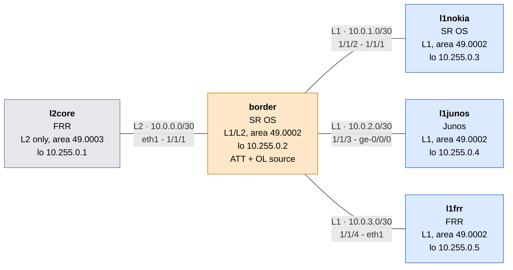

# isis_interop

Small containerlab lab that shows a difference between Nokia SR OS, Juniper Junos and FRR when an L1 router receives an IS-IS LSP with the attached bit (ATT) and the overload bit (OL) set at the same time.

Result on this lab (SR OS 24.10.R3, vJunos-router 23.4R2-S6.9, FRR 10.2.5):

| L1 router | `border` sends ATT only | `border` sends ATT + OL | `border` sends OL only (ATT suppressed) | `border` sends max-metric (no OL, no ATT) |
|-----------|-------------------|-------------------|-----------------------------------|-------------------------------------|
| l1nokia (SR OS) | default route | no default route | no default route | no default route |
| l1junos (Junos) | default route | default route | no default route | no default route |
| l1frr (FRR) | default route | default route | no default route | no default route |

Every cell was read on the lab. Only Nokia refuses the default route of an overloaded attached router. The outputs are below, so the result can be read without containerlab.

## Requirements

> [!IMPORTANT]
> The two Nokia SR OS nodes (`border` and `l1nokia`) need a **Nokia SR OS vSIM license**. The license is not included in this repository and must never be committed. Without a valid license, the SR OS nodes do not boot.

- [containerlab](https://containerlab.dev) (tested with 0.79.0).
- Container images built with [vrnetlab](https://github.com/srl-labs/vrnetlab):
  - `vrnetlab/nokia_sros:24.10.R3`, from the Nokia SR OS vSIM image (from Nokia, with a license).
  - `vrnetlab/juniper_vjunos-router:23.4R2-S6.9`, from the Juniper vJunos-router image (free download from Juniper, no license needed).
- `quay.io/frrouting/frr:10.2.5`, pulled automatically (no license needed).
- The Nokia license file: save it next to the topology as `license.txt` (ignored by git), or change the `license:` path in `isis_interop.clab.yml`.

Logins are the defaults of the images (SR OS `admin` / `admin`, Junos `admin` / `admin@123`). `configs/l1junos.conf` holds the default Junos configuration of the vrnetlab image, with these default credentials.

## Topology



`l2core` gives `border` an L2 adjacency in another area, so `border` sets ATT in its L1 LSP. The three L1 routers have no other path out, so their default route can only come from the ATT bit.

| Node | Role | Management IP | Login |
|------|------|---------------|-------|
| l2core | FRR, L2 only | 172.20.20.101 | `docker exec -it clab-isis-interop-l2core vtysh` |
| border | SR OS, sender of ATT and OL | 172.20.20.102 | admin / admin |
| l1nokia | SR OS, L1 | 172.20.20.103 | admin / admin |
| l1junos | Junos, L1 | 172.20.20.104 | admin / admin@123 |
| l1frr | FRR, L1 | 172.20.20.105 | `docker exec -it clab-isis-interop-l1frr vtysh` |

## Deploy

From this directory, once the requirements above are met:

```bash
containerlab deploy -t isis_interop.clab.yml
```

All the nodes boot on their configuration (about 3 minutes until they are healthy). Destroy with `containerlab destroy -t isis_interop.clab.yml --cleanup`.

Log in with `ssh admin@clab-isis-interop-border` (same for `l1nokia`, `l1junos`) or `docker exec -it clab-isis-interop-<node> vtysh` for the FRR nodes.

FRR hellos are padded to the interface MTU and the adjacency with `border` does not come up, so `configs/*/frr.conf` set `no isis hello padding`.

## Baseline: ATT only

After deploy, `border` has no overload. Its L1 LSP carries `ATT` and the three L1 routers install a default route toward `border`. Commands:

- `border`: `show router isis database`
- `l1nokia`: `show router route-table 0.0.0.0/0`
- `l1junos`: `show isis database` and `show route 0.0.0.0/0 exact table inet.0`
- `l1frr`: `show isis database` and `show ip route 0.0.0.0/0`

```text
border# show router isis database
===============================================================================
Rtr Base ISIS Instance 0 Database 
===============================================================================
LSP ID                                  Sequence  Checksum Lifetime Attributes
-------------------------------------------------------------------------------
Displaying Level 1 database
-------------------------------------------------------------------------------
border.00-00                             0xf       0x9215   1141     L1L2 ATT
l1nokia.00-00                           0x4       0xf471   682      L1
l1junos.00-00                           0x4       0x898a   1171     L1
l1frr.00-00                             0x16      0xe576   1155     L1
Level (1) LSP Count : 4
Displaying Level 2 database
-------------------------------------------------------------------------------
l2core.00-00                            0x4       0x170a   947      L1L2
border.00-00                             0x12      0x9b5    1169     L1L2
Level (2) LSP Count : 2
===============================================================================
```

```text
l1nokia# show router route-table 0.0.0.0/0
===============================================================================
Route Table (Router: Base)
===============================================================================
Dest Prefix[Flags]                            Type    Proto     Age        Pref
      Next Hop[Interface Name]                                    Metric   
-------------------------------------------------------------------------------
0.0.0.0/0                                     Remote  ISIS      00h14m48s  15
       10.0.1.1                                                     10
-------------------------------------------------------------------------------
No. of Routes: 1
===============================================================================
```

```text
l1junos> show isis database
IS-IS level 1 link-state database:
LSP ID                      Sequence Checksum Lifetime Attributes
border.00-00                      0xf   0x9215     1126 L1 L2 Attached
l1nokia.00-00                    0x4   0xf471      668 L1
l1junos.00-00                    0x4   0x898a     1158 L1
l1frr.00-00                     0x16   0xe576     1141 L1
  4 LSPs
IS-IS level 2 link-state database:
  0 LSPs

l1junos> show route 0.0.0.0/0 exact table inet.0
inet.0: 9 destinations, 9 routes (9 active, 0 holddown, 0 hidden)
+ = Active Route, - = Last Active, * = Both
0.0.0.0/0          *[IS-IS/15] 00:14:53, metric 10
                    >  to 10.0.2.1 via ge-0/0/0.0
```

```text
l1frr# show isis database
Area LAB:
IS-IS Level-1 link-state database:
LSP ID                  PduLen  SeqNumber   Chksum  Holdtime  ATT/P/OL
border.00-00               177   0x0000000f  0x9215    1127    1/0/0
l1nokia.00-00             106   0x00000004  0xf471     669    0/0/0
l1junos.00-00             134   0x00000004  0x898a    1157    0/0/0
l1frr.00-00          *     95   0x00000016  0xe576    1141    0/0/0
    4 LSPs

l1frr# show ip route 0.0.0.0/0
Routing entry for 0.0.0.0/0
  Known via "isis", distance 115, metric 10, best
  Last update 00:00:47 ago
  * 10.0.3.1, via eth1, weight 1
```

## Overload: ATT + OL

On `border`:

```text
configure private
/configure router "Base" isis 0 overload
commit
```

The L1 LSP of `border` now shows `ATT` and `OV`. `l1nokia` has no default route. `l1junos` and `l1frr` keep theirs. The same commands as in the baseline give:

```text
border# show router isis database
===============================================================================
Rtr Base ISIS Instance 0 Database 
===============================================================================
LSP ID                                  Sequence  Checksum Lifetime Attributes
-------------------------------------------------------------------------------
Displaying Level 1 database
-------------------------------------------------------------------------------
border.00-00                             0x10      0x940e   1168     L1L2 ATT
                                                                    OV
l1nokia.00-00                           0x4       0xf471   632      L1
l1junos.00-00                           0x4       0x898a   1121     L1
l1frr.00-00                             0x16      0xe576   1105     L1
Level (1) LSP Count : 4
Displaying Level 2 database
-------------------------------------------------------------------------------
l2core.00-00                            0x4       0x170a   897      L1L2
border.00-00                             0x14      0x4d39   1169     L1L2 OV
Level (2) LSP Count : 2
===============================================================================
```

```text
l1nokia# show router route-table 0.0.0.0/0
===============================================================================
Route Table (Router: Base)
===============================================================================
Dest Prefix[Flags]                            Type    Proto     Age        Pref
      Next Hop[Interface Name]                                    Metric   
-------------------------------------------------------------------------------
-------------------------------------------------------------------------------
No. of Routes: 0
===============================================================================
```

```text
l1junos> show isis database
IS-IS level 1 link-state database:
LSP ID                      Sequence Checksum Lifetime Attributes
border.00-00                     0x10   0x940e     1153 L1 L2 Overload Attached
l1nokia.00-00                    0x4   0xf471      618 L1
l1junos.00-00                    0x4   0x898a     1108 L1
l1frr.00-00                     0x16   0xe576     1091 L1
  4 LSPs
IS-IS level 2 link-state database:
  0 LSPs

l1junos> show route 0.0.0.0/0 exact table inet.0
inet.0: 7 destinations, 7 routes (7 active, 0 holddown, 0 hidden)
+ = Active Route, - = Last Active, * = Both
0.0.0.0/0          *[IS-IS/15] 00:15:43, metric 10
                    >  to 10.0.2.1 via ge-0/0/0.0
```

```text
l1frr# show isis database
Area LAB:
IS-IS Level-1 link-state database:
LSP ID                  PduLen  SeqNumber   Chksum  Holdtime  ATT/P/OL
border.00-00               177   0x00000010  0x940e    1154    1/0/1
l1nokia.00-00             106   0x00000004  0xf471     619    0/0/0
l1junos.00-00             134   0x00000004  0x898a    1107    0/0/0
l1frr.00-00          *     95   0x00000016  0xe576    1091    0/0/0
    4 LSPs

l1frr# show ip route 0.0.0.0/0
Routing entry for 0.0.0.0/0
  Known via "isis", distance 115, metric 10, best
  Last update 00:01:37 ago
  * 10.0.3.1, via eth1, weight 1
```

On `l1junos` the IS-IS routes of `inet.0` change with the overload bit (9 destinations without it, 7 with it):

| Route on l1junos | Without overload | With overload |
|------------------|------------------|---------------|
| `0.0.0.0/0` (from the ATT bit) | present | present |
| `10.255.0.2/32` (loopback of `border`) | present | present |
| `10.0.1.0/30`, `10.0.3.0/30` (subnets directly attached to `border`) | present | present |
| `10.255.0.3/32` (loopback of `l1nokia`, behind `border`) | present, metric 20 | gone |
| `10.255.0.5/32` (loopback of `l1frr`, behind `border`) | present, metric 30 | gone |

Junos applies the overload bit to the SPF: it keeps the routes to `border` itself and to the subnets attached to `border`, and drops the routes that cross `border` to reach another router. This is what [RFC 3787](https://www.rfc-editor.org/rfc/rfc3787) section 4 describes (no transit, directly attached prefixes still used). Junos does not apply the same rule to the default route, which it installs from the ATT bit toward `border`. The default route is not computed by the SPF: the router adds it when it sees `ATT` in the LSP.

Remove the overload again on `border`:

```text
configure private
/configure router "Base" isis 0 delete overload
commit
```

## Commands to avoid the default route through an overloaded `border`

The output of each is trimmed to the LSP of `border` and to the default route.

### On the sender (`border`, SR OS): the L1 routers of every vendor then agree

Suppress the attached bit while the overload bit stays set:

```text
configure private
/configure router "Base" isis 0 suppress-attached-bit true
commit
```

```text
border# show router isis database          (L1 part)
border.00-00                             0x11      0x8a1f   1168     L1L2 OV
l1junos> show isis database
border.00-00  L1 L2 Overload
l1junos> show route 0.0.0.0/0 exact table inet.0
(no route)
l1frr# show ip route 0.0.0.0/0
(no route)
l1nokia# show router route-table 0.0.0.0/0
No. of Routes: 0
```

Or use max-metric instead of the overload bit. The LSP then shows neither `OV` nor `ATT`:

```text
configure private
/configure router "Base" isis 0 delete suppress-attached-bit
/configure router "Base" isis 0 delete overload
/configure router "Base" isis 0 overload max-metric true
commit
```

```text
border# show router isis database          (L1 part)
border.00-00                             0x13      0xcdfe   1169     L1L2
l1junos> show isis database
border.00-00  L1 L2
l1frr# show isis database
border.00-00               177   0x00000013  0xcdfe    1154    0/0/0
l1junos, l1frr and l1nokia: no default route
```

### On the receiver: ignore the attached bit (every ATT, not only the ones sent with overload)

Junos (`l1junos`), tested with `border` in overload:

```text
configure
set protocols isis ignore-attached-bit
commit
```

```text
l1junos> show isis database
border.00-00  L1 L2 Overload Attached
l1junos> show route 0.0.0.0/0 exact table inet.0
(no route)
```

Nokia (`l1nokia`), tested with `border` without overload (the baseline):

```text
configure private
/configure router "Base" isis 0 ignore-attached-bit true
commit
```

```text
border# show router isis database          (L1 part)
border.00-00                             0x17      0x821d   1168     L1L2 ATT
l1nokia# show router route-table 0.0.0.0/0
No. of Routes: 0
```

FRR (`l1frr`), tested with `border` without overload:

```text
configure terminal
router isis LAB
 attached-bit receive ignore
end
```

```text
l1frr# show isis database
border.00-00               177   0x00000017  0x821d    1101    1/0/0
l1frr# show ip route 0.0.0.0/0
(no route)
```

Junos has no option found here that drops the default route only when the sender also has the overload bit. `ignore-attached-bit` is global for the instance: it ignores the ATT bit of every neighbor.

## Overload with max-metric (SR OS)

Besides the overload bit, a router can be drained by advertising its links with a very high metric. [RFC 3277](https://www.rfc-editor.org/rfc/rfc3277) describes the idea, and each vendor has its own command: `overload max-metric true` on SR OS, `overload advertise-high-metrics` on Junos (see below). On SR OS, `overload max-metric true` does not set the overload bit. The SR OS help says: "Advertise transit links with maximum metric instead of setting overload bit". In the LSP of `border`, every IS neighbor goes to the maximum metric of SR OS:

```text
border# show router isis database border.00-00 level 2 detail
  TE IS Nbrs   :
    Nbr   : l2core.00
    Default Metric  : 16777214
```

16777214 is 2^24 - 2: the highest metric of the extended IS reachability TLV that the SPF still uses. [RFC 5305](https://www.rfc-editor.org/rfc/rfc5305), section 3 (The Extended IS Reachability TLV):

> The metric octets are encoded as a 24-bit unsigned integer.

> If a link is advertised with the maximum link metric (2^24 - 1), this link MUST NOT be considered during the normal SPF computation. This will allow advertisement of a link for purposes other than building the normal Shortest Path Tree.

RFC 5305 obsoletes the informational [RFC 3784](https://www.rfc-editor.org/rfc/rfc3784), which has the same text. [RFC 3277](https://www.rfc-editor.org/rfc/rfc3277), section 4 (Potential Alternatives), describes this metric-based alternative to the overload bit:

> The advantage of a metric-based mechanism over the Overload bit mechanism model proposed here is that transit paths may still be calculated through the router.

The prefix metrics of the LSP do not change.

### Effect on the attached bit

With max-metric, SR OS does not set the attached bit in the L1 LSP: the LSP is `L1L2`, with neither `OV` nor `ATT`. The L1 routers of every vendor then have no default route toward `border`, because the `ATT` bit that creates it is missing. This is the normal behavior of SR OS 24.10 in this mode.

| `border` configuration | L1 LSP of border | Default route on the three L1 routers |
|--------------------|--------------|---------------------------------------|
| nothing | `L1L2 ATT` | yes |
| `overload` | `L1L2 ATT` + `OV` | no on l1nokia, yes on l1junos and l1frr |
| `overload max-metric true` | `L1L2` | no on the three |

```text
border# show router isis database          (L1 part, overload bit)
border.00-00                             0x1e      0x781c   1160     L1L2 ATT
                                                                    OV

border# show router isis database          (L1 part, max-metric)
border.00-00                             0x1c      0xbb08   1153     L1L2
```

Max-metric is therefore a way to drain `border` that gives the same result on Nokia, Junos and FRR access routers, unlike the overload bit.

### What a Junos router sees with max-metric

IS-IS routes of `inet.0` on `l1junos`, with `border` in each mode (`show route table inet.0 protocol isis`):

| Route on l1junos | Without overload | Overload bit | `overload max-metric true` |
|------------------|------------------|--------------|----------------------------|
| `0.0.0.0/0` (from the ATT bit) | metric 10 | metric 10 | gone |
| `10.255.0.2/32` (loopback of `border`) | 10 | 10 | 10 |
| `10.0.1.0/30`, `10.0.3.0/30` (subnets attached to `border`) | 20 | 20 | 20 |
| `10.255.0.3/32` (loopback of `l1nokia`, behind `border`) | 20 | gone | 16777224 |
| `10.255.0.5/32` (loopback of `l1frr`, behind `border`) | 30 | gone | 16777234 |
| number of destinations in `inet.0` | 9 | 7 | 8 |

With the overload bit, the routes behind `border` disappear. With max-metric they stay, with a huge metric: 16777224 is 10 (link of `l1junos` to `border`) + 16777214 (link of `border` to `l1nokia`) + 0 (loopback), and 16777234 is the same with the metric 10 of the loopback of `l1frr`. The prefixes advertised by `border` keep their metric (10 for the subnets, 0 for the loopback): only the IS neighbors change, so only the routes that cross `border` are affected. The default route is the only one that disappears, because the `ATT` bit is gone. `l1nokia` and `l1frr` show the same large metrics for the routes behind `border`.

### How to see max-metric: no overload flag in the database

In max-metric mode the LSP has no overload bit, so `show router isis database` shows no overload flag (`OV` on SR OS, the full word `Overload` on Junos; see the table in the section above): the output looks like a router that is not drained. The overload is visible in other places.

On `border`:

```text
border# show router isis status
Overload-On-Boot Timeout     : 120
Overload Max-Metric          : True
Overload-On-Boot Max-Metric  : True
Overload Include Locators    : Disabled
L1 LSDB Overload             : Manual  (Indefinitely in overload)
L2 LSDB Overload             : Manual  (Indefinitely in overload)

border# show router isis database border.00-00 level 1 detail
Attributes: L1L2                   Max Area  : 3        Alloc Len : 1492
    Nbr   : l1nokia.00
    Default Metric  : 16777214
    Nbr   : l1junos.00
    Default Metric  : 16777214
    Nbr   : l1frr.00
    Default Metric  : 16777214

border# admin show configuration flat | match overload
    configure router "Base" isis 0 overload max-metric true
```

On the L1 routers, the LSP of `border` shows the maximum metric on each IS neighbor and no flag:

```text
l1junos> show isis database border.00-00 extensive
border.00-00 Sequence: 0xe, Checksum: 0xd7f9, Lifetime: 1136 secs
   IS neighbor: l1nokia.00                    Metric: 16777214
   IS neighbor: l1junos.00                    Metric: 16777214
   IS neighbor: l1frr.00                      Metric: 16777214
    Checksum: 0xd7f9, Sequence: 0xe, Attributes: 0x3 <L1 L2>

l1frr# show isis database detail border.00-00
LSP ID                  PduLen  SeqNumber   Chksum  Holdtime  ATT/P/OL
border.00-00               177   0x0000000e  0xd7f9    1136    0/0/0
  Extended Reachability: 0000.0000.0003.00 (Metric: 16777214)
  Extended Reachability: 0000.0000.0004.00 (Metric: 16777214)
  Extended Reachability: 0000.0000.0005.00 (Metric: 16777214)
  Extended IP Reachability: 10.0.1.0/30 (Metric: 10)
  Extended IP Reachability: 10.0.2.0/30 (Metric: 10)
  Extended IP Reachability: 10.0.3.0/30 (Metric: 10)
  Extended IP Reachability: 10.255.0.2/32 (Metric: 0)
```

On Junos and FRR, a drained router that uses max-metric is recognized only by the metric 16777214 on its IS neighbors, with `Attributes: 0x3 <L1 L2>` on Junos and `ATT/P/OL` at `0/0/0` on FRR.

### overload-on-boot with max-metric

On `border`:

```text
configure private
/configure router "Base" isis 0 overload-on-boot timeout 120
/configure router "Base" isis 0 overload-on-boot max-metric true
commit
```

Added on a running router, it changes nothing: the LSP of `border` and the default routes of the three L1 routers stay the same, and `show router isis status` only shows `Overload-On-Boot Max-Metric : True`. The command acts at the next boot. Test: `admin save`, then `admin reboot now` on `border` (`border` without any `overload`), with the L1 LSP of `border` and the default routes of the L1 routers read every 25 seconds.

| Time | L1 LSP of border | Default route on the three L1 routers |
|------|--------------|---------------------------------------|
| after the boot, IS-IS up (15:11:45 to 15:13:21) | `L1L2` (no `OV`, no `ATT`) | none |
| about 120 seconds later (15:13:45) | `L1L2 ATT` | yes, on all three |

The log of `border` shows the two events: `Overload (event manualOnBoot ...)` at boot and `Overload (event notInOverload ...)` at the end of the timeout.

`overload-on-boot` with `max-metric` behaves like `overload max-metric`: no overload bit and no attached bit for as long as the router is in the overload state. The `ATT` bit comes back by itself at the end of the state, without any change of configuration.

### overload-on-boot max-metric and a manual overload

The `max-metric` option of `overload-on-boot` also changes what a manual `overload` advertises, even when the router has not rebooted. On `border`:

```text
configure private
/configure router "Base" isis 0 overload-on-boot timeout 1200
/configure router "Base" isis 0 overload-on-boot max-metric true
commit
```

With only this, the LSP of `border` is `L1L2 ATT`. Then the plain overload:

```text
/configure router "Base" isis 0 overload
commit
```

The L1 LSP of `border` becomes `L1L2 OV`: the overload bit is set and the `ATT` bit is missing, as if the manual `overload` inherited the `max-metric` of `overload-on-boot`. The metrics of the IS neighbors stay at 10 (`show router isis database border.00-00 level 1 detail`), so it is not a real max-metric advertisement. `show router isis status` shows `Overload Max-Metric : False` and `Overload-On-Boot Max-Metric : True`. No L1 router has a default route, not even l1junos and l1frr, because the `ATT` bit is missing.

Same plain `overload` with other `overload-on-boot` settings, each read on the lab:

| `overload-on-boot` | `overload` | L1 LSP of border | Default route on l1nokia | Default route on l1junos | Default route on l1frr |
|--------------------|------------|--------------|--------------------------|--------------------------|------------------------|
| none | none | `L1L2 ATT` | yes | yes | yes |
| none | plain, set after | `L1L2 ATT` + `OV` | no | yes | yes |
| `timeout 1200` | plain, set after | `L1L2 ATT` + `OV` | no | yes | yes |
| `timeout 1200` + `max-metric true` | plain, set after | `L1L2 OV` (**no `ATT`**) | no | no | no |
| `timeout 1200` + `max-metric true`, then `max-metric` removed (the `overload` stays) | plain | `L1L2 ATT` + `OV` | no | yes | yes |
| none, then `max-metric true` added while the `overload` is already active | plain | `L1L2 ATT` + `OV` (the LSP is not regenerated) | no | yes | yes |
| none | `max-metric true` | `L1L2` (no `OV`, no `ATT`) | no | no | no |

The order matters. With `overload-on-boot max-metric true` configured first, the manual `overload` gives `OV` without `ATT`. With the `overload` first and the `max-metric` added after, the LSP does not change, until the LSP is generated again (for example by `delete overload`, then `overload`). Removing the `max-metric` of `overload-on-boot` while the `overload` is active brings `ATT` back at once.

In short, in these tests the `ATT` bit is absent from the LSP of `border` whenever a `max-metric` option is configured (in `overload` or in `overload-on-boot`) at the moment the router enters the overload state. The `OV` bit is set only when the overload is configured without `max-metric` in `overload`.

### What the Juniper documentation says

[Junos `overload` statement](https://juniper.net/documentation/en_US/junos12.2/topics/reference/configuration-statement/overload-edit-protocols-isis.html) (Junos 12.2 page), option `advertise-high-metrics`:

> Advertise maximum link metrics in NLRIs instead of setting the overload bit. [...] When advertise-high-metric is configured, IS-IS does not set the overload bit. Rather, it sets the metric to 63 or 16,777,214, depending whether wide metrics are enabled. This allows the overloaded routing device to be used for transit as a last resort. An L1-L2 router in overload mode stops leaking route information between L1 and L2 levels and clears its attached bit. This is also true when advertise-high-metrics is configured.

- The wide-metric value of Junos (16,777,214) is the one that SR OS sends.
- On Junos, an L1-L2 router in overload mode clears its attached bit in general, and "this is also true" with `advertise-high-metrics`. On SR OS, the plain `overload` keeps `ATT` and only the max-metric mode clears it.

### What the Nokia documentation says

| Source | Text |
|--------|------|
| [7750 SR OS 14.0.R4 IS-IS CLI reference](https://infocenter.nokia.com/public/7750SR140R4/topic/com.sr.unicast/html/isis-cli.html) (old release), `overload` | "max-metric: Set the maximum metric in addition to overload." |
| same page, `overload-on-boot` | "max-metric: Sets the maximum metric instead of overload." |
| same page, `overload` | "When in the overload state, the router is only used if the destination is reachable by the router and will not used for other transit traffic." |
| same page, `suppress-attached-bit` | "suppress setting the attached bit on originated Level 1 LSPs to prevent all L1 routers in the area from installing a default route to it" |
| same page, `ignore-attached-bit` | "ignore the attached bit on received Level 1 LSPs to disable installation of default routes" |
| [SR OS 24.10 YANG model](https://github.com/nokia/7x50_YangModels/blob/master/latest_sros_24.10/nokia-combined/nokia-conf.yang) (`nokia-conf`), `router isis overload max-metric` | "Advertise transit links with maximum metric instead of setting overload bit" |
| same file, `router isis suppress-attached-bit` | "Allow IS-IS to suppress setting attached bit on LSPs" |

The meaning of `overload max-metric` changed between the releases: "in addition to overload" in the 14.0.R4 page, "instead of setting overload bit" in the 24.10 YANG model. The 24.10 lab matches the second text: the LSP has no `OV`. The text about the attached bit comes from the same sources: `suppress-attached-bit` exists to stop L1 routers from installing a default route toward the router.

## What the documentation says

The question is: what must an L1 router do with the default route when the LSP of the attached router also has the overload bit? The short answer is that no document read here says.

### RFCs

| Document | What it says | What it does not say |
|----------|--------------|----------------------|
| [RFC 1195](https://www.rfc-editor.org/rfc/rfc1195), section 1.2 | An L2 router that lost the L2 backbone "will indicate in its level 1 LSPs that it is not "attached"". L1 routers "route traffic to destinations outside of their area only to level 2 routers which indicate in their level 1 LSPs that they are "attached"". | Nothing about the overload bit. |
| [RFC 3787](https://www.rfc-editor.org/rfc/rfc3787), section 4 (Overload Bit) | "Section 7.2.8.1 of ISO 10589 instructs other systems not to use the overloaded IS as a transit router." "However, an overloaded router may be used to reach End Systems directly attached to the router". The receiver "SHOULD treat all IP reachability advertisements as directly connected". | Nothing about the attached bit or the default route. |
| [RFC 3787](https://www.rfc-editor.org/rfc/rfc3787), section 7 (The Attached Bit) | Refers to ISO 10589 section 7.2.9.2 for the algorithm that sets the `attachedFlag`. Some implementations also set it when a default route exists. | Only the sender side. Nothing about what a receiver does with it. |
| [RFC 3787](https://www.rfc-editor.org/rfc/rfc3787), section 8 (Default Route) | An implementation "MAY generate default routes in Level 1". | Nothing about the overload bit. |
| [RFC 3277](https://www.rfc-editor.org/rfc/rfc3277), sections 2 and 3 | Use of the overload bit while BGP synchronizes. "If the Overload bit is set in a router's LSP, NO transit paths are calculated through the router." | Nothing about the attached bit. |

No paragraph of RFC 1195, RFC 3277, RFC 3784 or RFC 3787 mentions the overload bit and the attached bit together.

The two bits are defined by ISO 10589, which is not an RFC and not freely available: the overload bit in 7.3.19 and 7.2.8.1, the attached bit in 7.2.9.2 (section numbers as quoted by RFC 3787). ISO 10589 itself was not read.

Consequence: the RFCs leave this to the implementation. Observed on this lab: SR OS does not install the default route of an attached and overloaded router, and Junos and FRR install it. The reason is not documented in the sources above.

### Vendor documentation

The Junos page for [`ignore-attached-bit`](https://juniper.net/documentation/en_US/junos12.3/topics/reference/configuration-statement/ignore-attached-bit-edit-protocols-isis.html) describes the receiver and does not mention the overload bit. The Junos page for [`overload`](https://juniper.net/documentation/en_US/junos12.2/topics/reference/configuration-statement/overload-edit-protocols-isis.html) says that an L1-L2 router in overload mode clears its attached bit, which is about what a router sends. Neither page says what a receiver does with an LSP that carries both bits, and no Nokia page on the combination was found.
