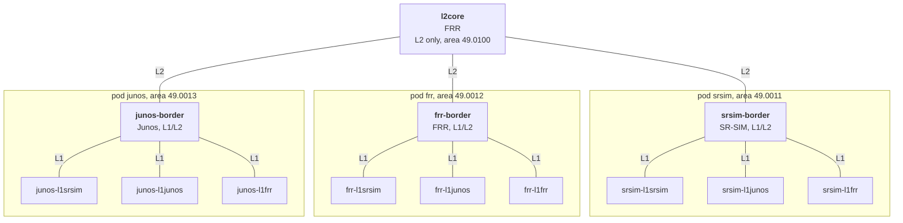

# isis_interop_drain

Containerlab labs that drain an IS-IS L1/L2 router with each vendor as the drained router (Nokia SR OS, Juniper Junos, FRR), and read what the L1 routers of each vendor do with their default route. This is the follow-up of [`isis_interop`](../isis_interop/README.md), which has only one SR OS L1/L2 router.

Releases: Nokia SR-SIM 26.3.R1, Juniper vJunos-router 23.4R2-S6.9, FRR 10.2.5. All links are point-to-point, with wide metrics. The L1 routers have no exit other than the default route from the attached bit (ATT) of the L1/L2 routers.

## Results

### One exit per L1 router

Main lab, `isis_interop_drain.clab.yml`. Summary: [`results/matrix.log`](results/matrix.log). Raw outputs: `results/<border>-<mode>/`.

| Drained border | Mode | Flags in its L1 LSP | l1srsim | l1junos | l1frr |
| --- | --- | --- | --- | --- | --- |
| SR OS | overload | ATT=1 OL=1 | no default route | default route | default route |
| SR OS | max-metric | ATT=0 OL=0 | no default route | no default route | no default route |
| SR OS | overload + `suppress-attached-bit` | ATT=0 OL=1 | no default route | no default route | no default route |
| FRR | overload | ATT=1 OL=1 | no default route | default route | default route |
| FRR | max-metric | ATT=1 OL=0 | default route | no default route | default route |
| Junos | overload | ATT=0 OL=1 | no default route | no default route | no default route |
| Junos | max-metric | ATT=0 OL=0 | no default route | no default route | no default route |

With no drain mode (`none`), every L1 router has a default route through its border.

### Three equal-cost exits

Lab `two_exit/isis_two_exit.clab.yml`. Summary: [`matrix-two-exit-reparsed.log`](matrix-two-exit-reparsed.log). Raw outputs: `results-two-exit/border-<vendor>-<mode>/`. "Leaves" means that the drained border is no longer a next hop of the default route.

| Drained border | Mode | Flags in its L1 LSP | l1-srsim | l1-junos | l1-frr |
| --- | --- | --- | --- | --- | --- |
| SR OS | overload | ATT=1 OL=1 | leaves | stays | stays |
| SR OS | max-metric | ATT=0 OL=0 | leaves | leaves | leaves |
| SR OS | overload + `suppress-attached-bit` | ATT=0 OL=1 | leaves | leaves | leaves |
| FRR | overload | ATT=1 OL=1 | leaves | stays | stays |
| FRR | max-metric | ATT=1 OL=0 | stays | leaves | stays |
| Junos | overload | ATT=0 OL=1 | leaves | leaves | leaves |
| Junos | max-metric | ATT=0 OL=0 | leaves | leaves | leaves |

`matrix-two-exit-reparsed.log` was made again from the saved raw outputs with `collect_two_exit.py reparse`. Use it rather than `matrix-two-exit.log`, the summary printed during the first run.

### Two exits, no Junos border

Lab `two_exit_nj/isis_two_exit_nj.clab.yml`: the three-exit lab without `border-junos`, so two exits (SR OS and FRR) and the same three L1 routers. It tests the FRR border with and without `no attached-bit send`. Raw outputs: `results-two-exit-nj/border-frr-<mode>/`, read with `python3 state_two_exit_nj.py <label>`.

| FRR border mode | Flags in its L1 LSP | l1-srsim | l1-junos | l1-frr |
| --- | --- | --- | --- | --- |
| `set-overload-bit` | ATT=1 OL=1 | leaves | stays | stays |
| `advertise-high-metrics` | ATT=1 OL=0, links at `16777215` | stays | leaves | stays |
| `set-overload-bit` + `no attached-bit send` | ATT=0 OL=1 | leaves | leaves | leaves |
| `advertise-high-metrics` + `no attached-bit send` | ATT=0 OL=0 | leaves | leaves | leaves |

Without a drain mode (`none`), and after the border is restored (`restored`), every L1 router uses both borders.

### Two exits, no Junos at all

Lab `two_exit_no_junos/isis_two_exit_no_junos.clab.yml`: the three-exit lab without the Junos nodes. It tests the FRR border with `set-overload-bit`, with `set-overload-bit` and `no attached-bit send`, and with `advertise-high-metrics` and `no attached-bit send`. Results: [`two_exit_no_junos/results.txt`](two_exit_no_junos/results.txt).

### Maximum link metric

`collect.py maxlink` sets the metric `16777215` (2^24 - 1), then `16777214`, on the link of each L1 router toward the SR OS border, in the `srsim` pod, and then restores the metric 10. `collect.py maxlink reverse` sets them on the links of the border toward the L1 routers. Raw outputs: `results/maxlink-forward-*/` and `results/maxlink-reverse-*/`.

## Requirements

> [!IMPORTANT]
> The SR-SIM nodes need a **Nokia SR-SIM license**. The license is not included in this repository and must never be committed (`license.txt` and `*.lic` are ignored by git). Without a valid license, the SR-SIM nodes do not boot.

- [containerlab](https://containerlab.dev).
- `nokia_srsim:26.3.R1`, the Nokia SR-SIM container image (from Nokia, with a license).
- `vrnetlab/juniper_vjunos-router:23.4R2-S6.9`, built with [vrnetlab](https://github.com/srl-labs/vrnetlab) from the Juniper vJunos-router image (free download from Juniper, no license needed).
- `quay.io/frrouting/frr:10.2.5`, pulled automatically (no license needed).
- The Nokia license file: save it next to the topology as `license.txt`. The generators read the `SRSIM_IMAGE` and `SRSIM_LICENSE` environment variables to change the image or the license path.
- Python 3, to regenerate the labs and to run the collect scripts. The collect scripts run on the containerlab server: they use `docker exec` for FRR and SSH to the management address for SR-SIM and Junos.

Logins: SR-SIM `admin` / `NokiaSros1!`, Junos `admin` / `admin@123`, FRR with `docker exec -it <container> vtysh`.

## Topologies

### Main lab: one pod per border vendor

`isis_interop_drain.clab.yml`, lab name `isis-interop-drain`, management network `172.31.111.0/24`. Thirteen nodes: three independent pods share one level 2 core. In each pod, one L1/L2 border of a different vendor serves three L1 routers (SR-SIM, Junos, FRR).



### Three-exit lab

`two_exit/isis_two_exit.clab.yml`, lab name `isis-two-exit`, management network `172.31.112.0/24`. Three L1/L2 borders (`border-srsim`, `border-frr`, `border-junos`) and three L1 routers (`l1-srsim`, `l1-junos`, `l1-frr`) in area 49.0011, plus `l2core` in area 49.0100. Every L1 router links to every border with the metric 10, so each L1 router has three equal-cost next hops for `0.0.0.0/0`. The SR-SIM L1 router has `ecmp 3` so that it can install the three next hops. The second octet of a link address (`10.<border>.<l1 router>.x`) tells the border of a next hop: 1 is SR-SIM, 2 is FRR, 3 is Junos.

`two_exit_nj/isis_two_exit_nj.clab.yml` (lab name `isis-two-exit-nj`, management network `172.31.114.0/24`) uses the same configurations, from `two_exit/configs/`, without `border-junos`. `two_exit_no_junos/isis_two_exit_no_junos.clab.yml` (lab name `isis-two-exit-no-junos`, management network `172.31.113.0/24`) has no Junos node at all.

## Run

Deploy a lab from this directory:

```bash
containerlab deploy -t isis_interop_drain.clab.yml
containerlab deploy -t two_exit/isis_two_exit.clab.yml
```

Change the state of a border and read the result:

```bash
python3 collect.py state               # border flags and default routes of every pod
python3 collect.py set srsim overload  # drain the border of the srsim pod, then print its state
python3 collect.py matrix              # every pod with every mode, raw outputs in results/
python3 collect_two_exit.py state      # next hops of the default route in the three-exit lab
python3 collect_two_exit.py matrix     # every border with every mode, raw outputs in results-two-exit/
python3 collect_two_exit.py reparse    # print the summary again from the saved raw outputs
```

Modes: `none`, `overload`, `max-metric`, and `overload-suppress-att` (SR OS only). Run a script with no argument to print its usage.

Before it applies a mode, a script removes every drain setting from the border, so each mode starts from a clean border. It then waits 40 seconds, for the LSP flooding and the SPF, before it reads the state.

Destroy a lab with `containerlab destroy -t <topology> --cleanup`.

## Files

| File | Role |
| --- | --- |
| `gen.py` | Generates the main lab: `isis_interop_drain.clab.yml` and `configs/`. |
| `gen_two_exit.py` | Generates the three-exit lab in `two_exit/`. It deletes and writes again the whole `two_exit/` directory. |
| `collect.py` | Changes the drain mode of a border and collects the state of the main lab. |
| `collect_two_exit.py` | The same for the three-exit lab. |
| `results/` | Raw outputs and summary (`matrix.log`) of the main lab. |
| `results-two-exit/` | Raw outputs of the three-exit lab. |
| `matrix-two-exit-reparsed.log` | Summary of the three-exit lab. |
| `two_exit_nj/`, `state_two_exit_nj.py`, `results-two-exit-nj/` | Topology, state script and raw outputs of the lab without the Junos border. |
| `two_exit_no_junos/` | Topology, `state.sh` and results of the lab without any Junos node. |
